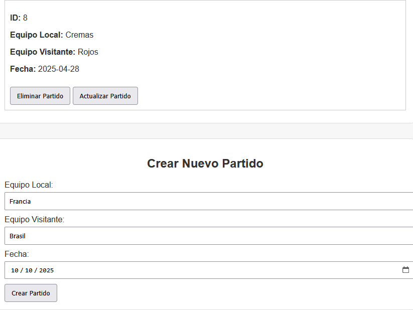
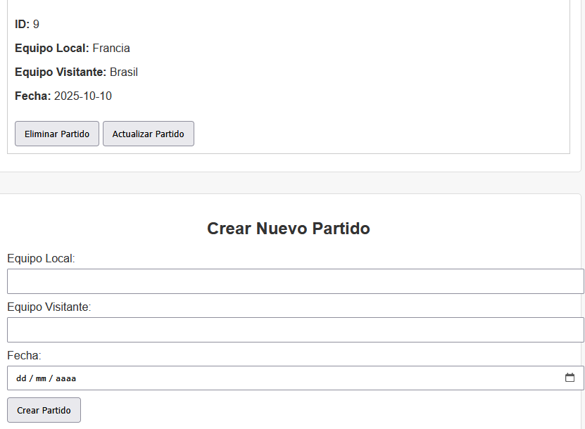
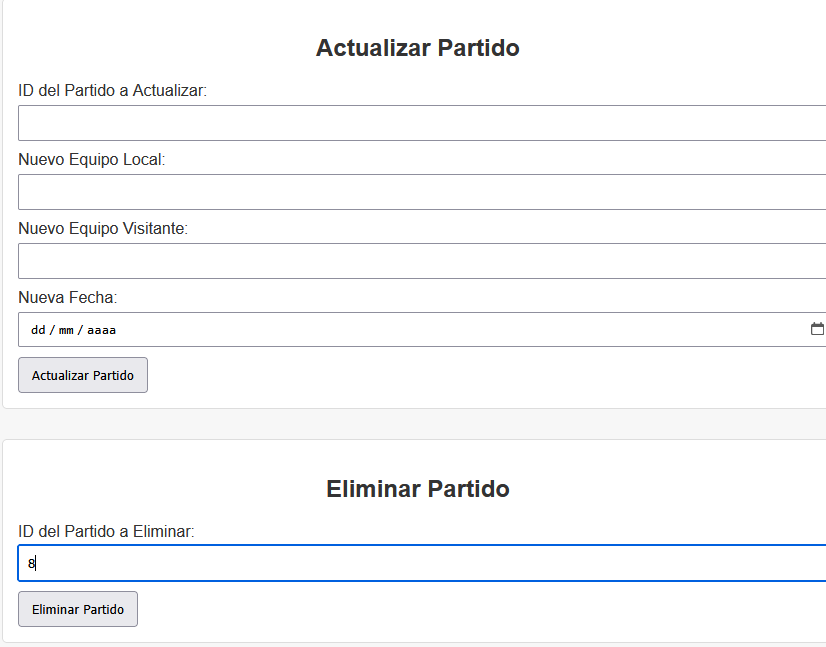
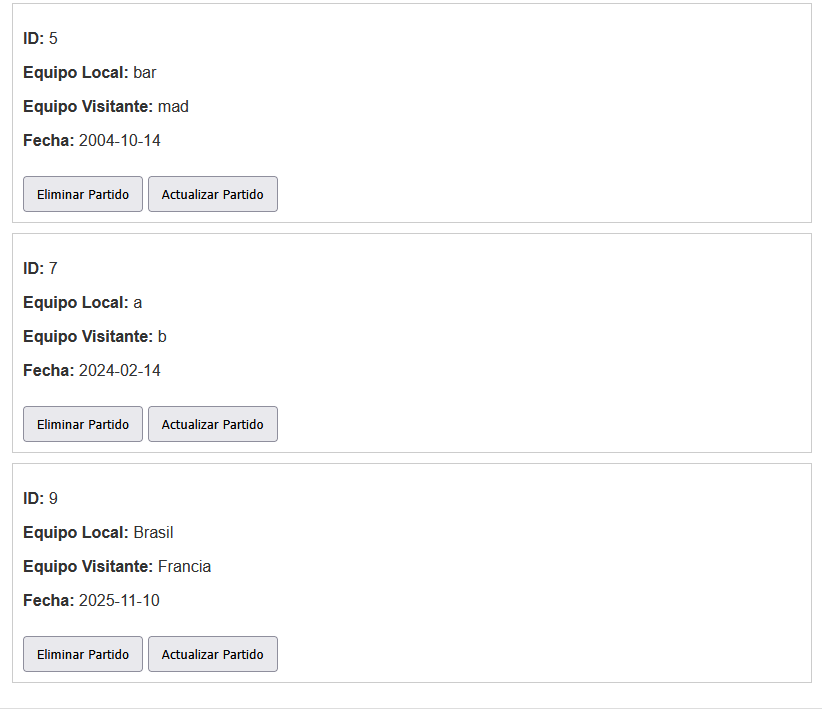
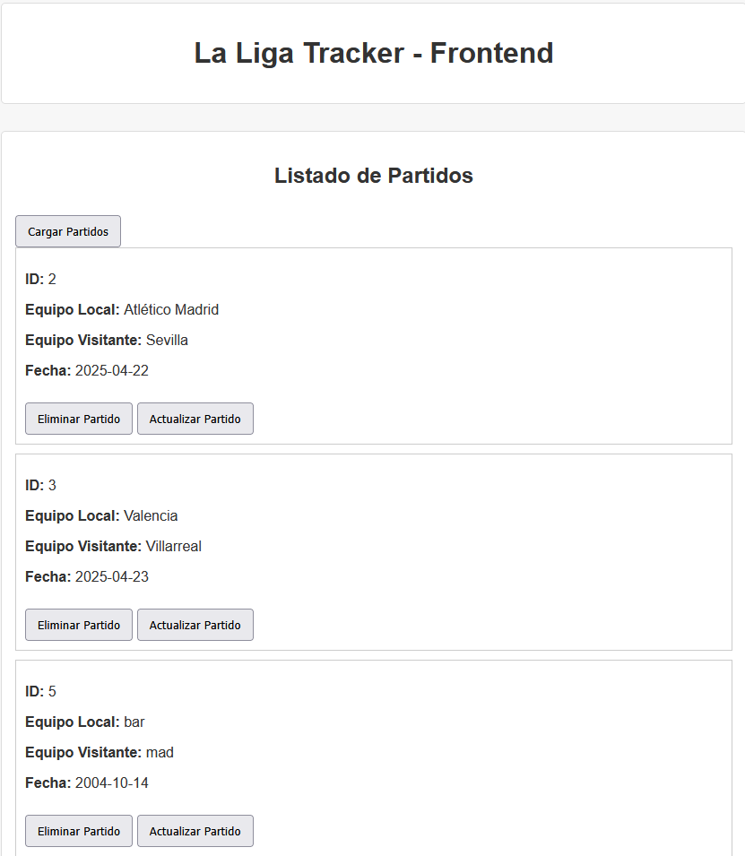
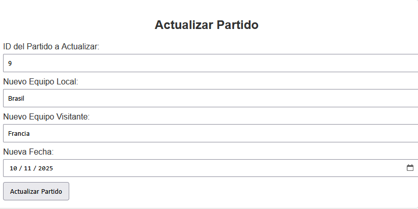

# lab6web
# La Liga Tracker API

## Descripción
La API de **La Liga Tracker** permite gestionar partidos de fútbol. Ofrece funcionalidades para:
- Crear nuevos partidos
- Consultar partidos existentes
- Actualizar el marcador
- Registrar tarjetas amarillas y rojas
- Establecer el tiempo extra de un partido

## Endpoints disponibles
- **GET** `/api/matches` - Obtener todos los partidos
- **GET** `/api/matches/{id}` - Obtener un partido por ID
- **POST** `/api/matches` - Crear un nuevo partido
- **PUT** `/api/matches/{id}` - Actualizar un partido
- **DELETE** `/api/matches/{id}` - Eliminar un partido
- **PATCH** `/api/matches/{id}/goals` - Registrar un gol
- **PATCH** `/api/matches/{id}/yellowcards` - Registrar una tarjeta amarilla
- **PATCH** `/api/matches/{id}/redcards` - Registrar una tarjeta roja
- **PATCH** `/api/matches/{id}/extratime` - Establecer tiempo extra

## Cómo ejecutar la API

1. Clona este repositorio.
2. Navega al directorio del backend y ejecuta el siguiente comando:
   go run main.go

Imagen de frontend funcionando: 

